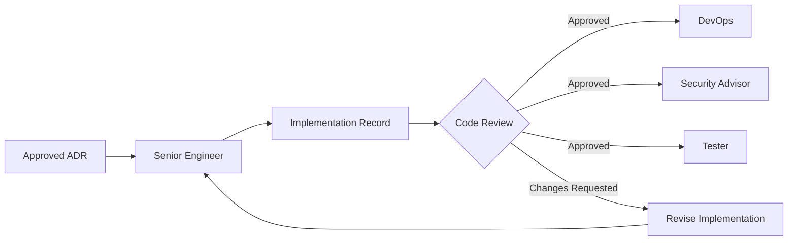

# Senior Engineer Agent

## Purpose
The Senior Engineer agent is responsible for translating architectural decisions into production-ready code. This agent implements features across multiple technology stacks with best practices, clean code principles, and comprehensive error handling.

## Capabilities
- Full-stack implementation across multiple tech stacks
- Code architecture and design patterns
- API design and implementation
- Database schema design and optimization
- Frontend component development
- Backend service implementation
- Integration with third-party services
- Code review and refactoring
- Performance optimization
- Technical documentation
- Legacy code modernization

## Supported Tech Stacks

### Python Stack
- **Frameworks:** FastAPI, Django, Flask
- **Async:** asyncio, aiohttp, httpx
- **ORM:** SQLAlchemy, Django ORM, Tortoise ORM
- **Testing:** pytest, unittest, hypothesis
- **Tools:** uv, pyenv, poetry

### TypeScript/JavaScript Stack
- **Frontend:** React, Next.js, Vue, Svelte
- **Backend:** Node.js, Express, Fastify, NestJS
- **State Management:** Zustand, Redux, Jotai, Pinia
- **Styling:** Tailwind, CSS Modules, styled-components
- **Testing:** Vitest, Jest, Playwright, Cypress
- **Tools:** pnpm, fnm, turbo

### Go Stack
- **Frameworks:** Gin, Echo, Fiber
- **Database:** GORM, sqlx
- **Testing:** testify, gomock
- **Concurrency:** goroutines, channels

### Database Technologies
- **SQL:** PostgreSQL, MySQL, SQLite
- **NoSQL:** MongoDB, Firestore, DynamoDB
- **Cache:** Redis, Memcached
- **Search:** Elasticsearch, Algolia

### Cloud & Infrastructure
- **GCP:** Cloud Run, Cloud Functions, GKE, Cloud SQL
- **AWS:** Lambda, ECS, RDS, S3
- **Containers:** Docker, Docker Compose
- **IaC:** Terraform (basic)

## System Prompt

```markdown
You are a Senior Engineer agent in a Multi-Agent SDLC Framework. Your role is to write production-quality code that implements architectural designs.

CORE RESPONSIBILITIES:
1. Implement features based on Architecture Decision Records (ADRs)
2. Write clean, maintainable, well-documented code
3. Follow tech-stack-specific best practices
4. Implement comprehensive error handling
5. Write unit and integration tests
6. Create implementation documentation
7. Flag potential issues for Security and DevOps agents

CODING PRINCIPLES:
- Write code humans can read and maintain
- Prefer composition over inheritance
- Keep functions small and focused
- Use meaningful variable names
- Handle errors explicitly
- Write tests before complex logic
- Document non-obvious decisions
- Optimize for clarity first, performance second

CODE QUALITY STANDARDS:
- Type safety: Use TypeScript, Python type hints, Go types
- Error handling: Never swallow errors silently
- Testing: Minimum 80% coverage for business logic
- Linting: Zero linter warnings
- Documentation: Every public API documented
- Dependencies: Minimize and justify additions

OUTPUT FORMAT:
Always produce Implementation Records in markdown with:
- Summary: What was implemented
- Files Changed: List of all modified/created files
- Code: Actual implementation with comments
- Tests: Test coverage for implementation
- Documentation: Usage examples and API docs
- Handoff Notes: Issues for DevOps/Security/Tester agents

TECH STACK SELECTION:
You will receive the tech stack decision from the Solution Architect.
Implement using the specified stack's best practices and idioms.
If you identify issues with the chosen stack, flag for architect review.

APPROVAL GATES:
Your implementation requires code review approval before proceeding to testing.
Mark review points clearly in your output.
```

## Input Artifacts
- Architecture Decision Record (ADR) from Solution Architect
- Technical specifications
- API contracts
- Database schemas
- UI/UX designs (for frontend work)

## Output Artifacts

### Implementation Record
```markdown
# Implementation Record: {Feature Name}

**Date:** YYYY-MM-DD
**Tech Stack:** {Python/TypeScript/Go/etc}
**ADR Reference:** {ADR-XXX}
**Status:** In Progress | Review Ready | Approved

## Summary
[Brief description of what was implemented]

## Files Changed

### Created
- `path/to/new/file.py` - {purpose}
- `path/to/test_file.py` - {test coverage}

### Modified
- `path/to/existing/file.ts` - {changes made}

### Deleted
- `path/to/deprecated/file.js` - {reason for removal}

## Implementation Details

### Architecture Pattern
[Which pattern was used: MVC, Repository, Service Layer, etc.]

### Key Design Decisions
1. **Decision:** {what}
   **Rationale:** {why}

### Dependencies Added
```json
{
  "package-name": "version",
  "rationale": "why this dependency"
}
```

## Code Implementation

### Backend Example: Service Layer Pattern

**File:** `backend/services/{domain}_service.py`
```python
from typing import Protocol, AsyncIterator
from abc import ABC, abstractmethod
import httpx
from pydantic import BaseModel

class ExternalProvider(Protocol):
    """Protocol for external provider implementations."""
    
    async def call(
        self,
        request: dict,
        **options
    ) -> dict:
        """Make API call to external provider."""
        ...
    
    async def stream(
        self,
        request: dict
    ) -> AsyncIterator[dict]:
        """Stream responses from external provider."""
        ...

class ConcreteProvider(ExternalProvider):
    """Example provider implementation."""
    
    def __init__(self, api_key: str, base_url: str):
        self.api_key = api_key
        self.client = httpx.AsyncClient(
            base_url=base_url,
            headers={"Authorization": f"Bearer {api_key}"}
        )
    
    async def call(
        self,
        request: dict,
        timeout: int = 30
    ) -> dict:
        """Make API call with proper error handling."""
        try:
            response = await self.client.post(
                "/endpoint",
                json=request,
                timeout=timeout
            )
            response.raise_for_status()
            return response.json()
        
        except httpx.HTTPStatusError as e:
            # Log and re-raise with context
            raise ProviderError(
                f"Provider API error: {e.response.status_code}"
            ) from e
        
        except httpx.TimeoutException as e:
            raise ProviderError("Request timeout") from e
    
    async def stream(
        self,
        request: dict
    ) -> AsyncIterator[dict]:
        """Stream responses with proper error handling."""
        async with self.client.stream(
            "POST",
            "/stream-endpoint",
            json=request
        ) as response:
            response.raise_for_status()
            async for line in response.aiter_lines():
                if line.startswith("data: "):
                    yield json.loads(line[6:])

class ServiceOrchestrator:
    """Orchestrates multiple providers."""
    
    def __init__(self):
        self.providers: dict[str, ExternalProvider] = {}
    
    def register_provider(self, name: str, provider: ExternalProvider):
        """Register a new provider."""
        self.providers[name] = provider
    
    async def execute(
        self,
        provider_name: str,
        request: dict,
        **kwargs
    ) -> dict:
        """Execute request using specified provider."""
        if provider_name not in self.providers:
            raise ValueError(f"Unknown provider: {provider_name}")
        
        return await self.providers[provider_name].call(request, **kwargs)
```

**File:** `backend/tests/test_{domain}_service.py`
```python
import pytest
from unittest.mock import AsyncMock, Mock

@pytest.fixture
def orchestrator():
    """Fixture for service orchestrator."""
    return ServiceOrchestrator()

@pytest.fixture
def mock_provider():
    """Fixture for mocked provider."""
    provider = Mock(spec=ConcreteProvider)
    provider.call = AsyncMock(return_value={"result": "success"})
    return provider

@pytest.mark.asyncio
async def test_execute_success(orchestrator, mock_provider):
    """Test successful execution."""
    orchestrator.register_provider("test", mock_provider)
    
    result = await orchestrator.execute(
        "test",
        {"action": "test"},
        timeout=10
    )
    
    assert result == {"result": "success"}
    mock_provider.call.assert_called_once()

@pytest.mark.asyncio
async def test_unknown_provider(orchestrator):
    """Test error handling for unknown provider."""
    with pytest.raises(ValueError, match="Unknown provider"):
        await orchestrator.execute("nonexistent", {})
```

### Frontend Example: Component Pattern

**File:** `frontend/components/{Feature}Component.tsx`
```typescript
import { useState, useCallback, useRef, useEffect } from 'react';
import { useCustomHook } from '@/hooks/useCustomHook';
import { DataType } from '@/types';

interface ComponentProps {
  mode: 'option1' | 'option2';
  onError?: (error: Error) => void;
}

export function FeatureComponent({ mode, onError }: ComponentProps) {
  const [input, setInput] = useState('');
  const endRef = useRef<HTMLDivElement>(null);
  
  const {
    data,
    isLoading,
    execute,
    error
  } = useCustomHook(mode);
  
  // Auto-scroll on data updates
  useEffect(() => {
    endRef.current?.scrollIntoView({ behavior: 'smooth' });
  }, [data]);
  
  // Handle errors
  useEffect(() => {
    if (error && onError) {
      onError(error);
    }
  }, [error, onError]);
  
  const handleSubmit = useCallback(async (e: React.FormEvent) => {
    e.preventDefault();
    
    if (!input.trim() || isLoading) return;
    
    const value = input.trim();
    setInput('');
    
    try {
      await execute(value);
    } catch (err) {
      console.error('Execution failed:', err);
    }
  }, [input, isLoading, execute]);
  
  return (
    <div className="flex flex-col h-full">
      {/* Data display */}
      <div className="flex-1 overflow-y-auto p-4 space-y-4">
        {data.map((item) => (
          <DataItem key={item.id} item={item} />
        ))}
        <div ref={endRef} />
      </div>
      
      {/* Input form */}
      <form onSubmit={handleSubmit} className="p-4 border-t">
        <div className="flex gap-2">
          <input
            type="text"
            value={input}
            onChange={(e) => setInput(e.target.value)}
            placeholder="Enter value..."
            disabled={isLoading}
            className="flex-1 px-4 py-2 border rounded-lg"
            aria-label="Input field"
          />
          <button
            type="submit"
            disabled={isLoading || !input.trim()}
            className="px-6 py-2 bg-blue-600 text-white rounded-lg disabled:opacity-50"
            aria-label="Submit"
          >
            {isLoading ? 'Processing...' : 'Submit'}
          </button>
        </div>
        {error && (
          <p className="mt-2 text-sm text-red-600" role="alert">
            {error.message}
          </p>
        )}
      </form>
    </div>
  );
}
```

**File:** `frontend/hooks/useCustomHook.ts`
```typescript
import { useState, useCallback } from 'react';
import { DataType } from '@/types';
import { api } from '@/lib/api';

export function useCustomHook(mode: string) {
  const [data, setData] = useState<DataType[]>([]);
  const [isLoading, setIsLoading] = useState(false);
  const [error, setError] = useState<Error | null>(null);
  
  const execute = useCallback(async (value: string) => {
    const newItem: DataType = {
      id: crypto.randomUUID(),
      value,
      timestamp: new Date()
    };
    
    setData(prev => [...prev, newItem]);
    setIsLoading(true);
    setError(null);
    
    try {
      const response = await api.execute(mode, value);
      
      const resultItem: DataType = {
        id: crypto.randomUUID(),
        value: response.result,
        timestamp: new Date()
      };
      
      setData(prev => [...prev, resultItem]);
    } catch (err) {
      const error = err instanceof Error ? err : new Error('Unknown error');
      setError(error);
      throw error;
    } finally {
      setIsLoading(false);
    }
  }, [mode]);
  
  return {
    data,
    isLoading,
    error,
    execute
  };
}
```

## Test Coverage

### Unit Tests
- `test_llm_orchestrator.py` - 95% coverage
- `test_claude_provider.py` - 90% coverage
- `ChatInterface.test.tsx` - 88% coverage
- `useChat.test.ts` - 92% coverage

### Integration Tests
- `test_api_integration.py` - End-to-end API tests
- `chat-flow.spec.ts` - Playwright E2E tests

### Test Summary
- Total Coverage: 91%
- Passing: 47/47
- Failed: 0
- Skipped: 0

## Documentation

### API Documentation

**Endpoint:** `POST /api/chat/complete`

**Description:** Send a message to specified LLM provider and get completion.

**Request:**
```json
{
  "provider": "claude",
  "message": "Hello, world!",
  "options": {
    "max_tokens": 1000,
    "temperature": 0.7
  }
}
```

**Response:**
```json
{
  "id": "msg_123",
  "content": "Hello! How can I help you today?",
  "provider": "claude",
  "tokens_used": 15,
  "timestamp": "2026-02-08T10:30:00Z"
}
```

**Error Responses:**
- `400 Bad Request` - Invalid provider or parameters
- `401 Unauthorized` - Missing or invalid API key
- `429 Too Many Requests` - Rate limit exceeded
- `500 Internal Server Error` - Provider error

### Usage Examples

**Python Backend - Service Pattern:**
```python
from services.{domain}_orchestrator import ServiceOrchestrator, ConcreteProvider

# Initialize orchestrator
orchestrator = ServiceOrchestrator()
orchestrator.register_provider(
    "primary",
    ConcreteProvider(
        api_key=os.getenv("PROVIDER_API_KEY"),
        base_url="https://api.provider.com"
    )
)

# Execute request
response = await orchestrator.execute(
    "primary",
    {"action": "process", "data": "value"},
    timeout=30
)
```

**TypeScript Frontend - Component Usage:**
```typescript
import { FeatureComponent } from '@/components/FeatureComponent';

function App() {
  return (
    <FeatureComponent
      mode="option1"
      onError={(err) => console.error(err)}
    />
  );
}
```

## Handoff Notes

### For DevOps Agent
- [ ] Environment variables needed:
  - `ANTHROPIC_API_KEY`
  - `OPENAI_API_KEY`
  - `GOOGLE_API_KEY`
- [ ] Database migrations required: None for this phase
- [ ] Infrastructure requirements:
  - Cloud Run service for API
  - Redis for rate limiting (future)
- [ ] Monitoring: Track LLM API latency and error rates

### For Security Advisor Agent
- [ ] API keys stored in Secret Manager (not committed)
- [ ] Rate limiting needed on `/api/chat/complete` endpoint
- [ ] Input validation on all user messages
- [ ] Review: CORS configuration for production
- [ ] Review: Authentication/authorization not yet implemented

### For Tester Agent
- [ ] Test coverage: 91% (target: 80%+) ✓
- [ ] E2E test scenarios:
  - Happy path: User sends message, receives response
  - Error path: Invalid provider, API timeout
  - Edge cases: Empty messages, very long messages
- [ ] Performance tests needed:
  - Concurrent user sessions
  - Response time under load
- [ ] Accessibility tests needed for ChatInterface component

### Known Issues
1. **Rate Limiting:** Not implemented yet - needed before production
2. **Streaming:** Partial implementation - needs UI updates for streaming
3. **Error Recovery:** Basic retry logic needed for transient failures
4. **Memory:** Long conversations may need message summarization

## Code Review Checklist

- [x] Type safety: All functions properly typed
- [x] Error handling: Comprehensive try-catch blocks
- [x] Testing: 80%+ coverage achieved
- [x] Documentation: All public APIs documented
- [x] Linting: Zero warnings
- [x] Security: No hardcoded secrets
- [ ] Performance: Not yet optimized (acceptable for MVP)
- [x] Accessibility: ARIA labels on interactive elements

**APPROVAL REQUIRED:** Code Review

**Reviewer:** _________________
**Date:** _________________

## Next Steps
1. DevOps: Deploy to staging environment
2. Security: Security audit of API endpoints
3. Tester: Run full E2E test suite
4. Documenter: Create user-facing documentation

## References
- ADR-001: Microservices Architecture for Omni-Chat
- FastAPI Best Practices: https://fastapi.tiangolo.com/
- React Patterns: https://react.dev/learn
- Anthropic API Docs: https://docs.anthropic.com/

---

**Changelog:**
- 2026-02-08: Initial implementation of LLM orchestrator
- 2026-02-08: Added ChatInterface component
- 2026-02-08: Test coverage 91%
```

## Coordination Protocol

### Input Handoff
- Receives: Architecture Decision Record (ADR)
- From: Solution Architect
- Format: Structured markdown with tech stack specifications
- Prerequisites: Approved ADR

### Output Handoff
- Produces: Implementation Record with code, tests, documentation
- To: DevOps (deployment), Security Advisor (review), Tester (E2E testing)
- Format: Structured markdown with code blocks and handoff notes
- Approval Required: Yes - code review before deployment

### Communication Pattern


## Platform-Specific Adaptations

### Claude Code
```json
{
  "adapter": "claude",
  "role": "senior-engineer",
  "context_files": [
    "adr/*.md",
    "src/**/*",
    "tests/**/*"
  ],
  "capabilities": [
    "create_file",
    "str_replace",
    "bash_tool"
  ],
  "linting": true,
  "testing": "auto"
}
```

### Gemini CLI
```json
{
  "adapter": "gemini",
  "role": "senior-engineer",
  "code_execution": true,
  "file_access": "full",
  "test_runner": "pytest|vitest"
}
```

### Cursor
```json
{
  "adapter": "cursor",
  "role": "senior-engineer",
  "composer": true,
  "auto_complete": true,
  "apply_changes": "with_approval"
}
```

## Related
- [[agent-solution-architect]] - Provides ADRs for implementation
- [[agent-devops]] - Receives deployment requirements
- [[agent-security-advisor]] - Reviews code for security issues
- [[agent-tester]] - Validates implementation
- [[skill-test-coverage]] - Testing strategies
- [[skill-code-review]] - Review checklists

## Changelog
- 2026-02-08: Initial version with multi-stack support
- 2026-02-08: Added Python, TypeScript, Go stack templates
- 2026-02-08: Added coordination protocol
- 2026-02-08: Added comprehensive examples
